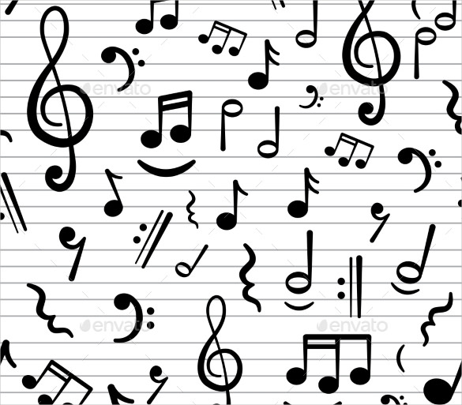
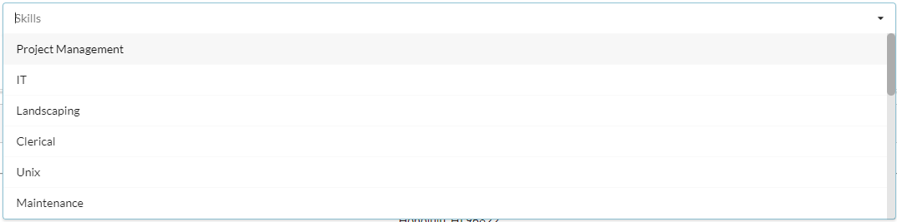
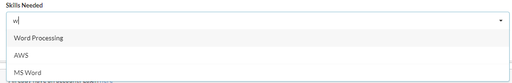

&emsp; There are a few languages which transcend the barriers of communication. There's math in which the language of numbers and logic allow for people to solve problems no matter what langauge they speak. There's also music, which symbols on a paper or a beautiful melody being played allow people of different cultures to share their emotions, thoughts, and heritage without saying a word. It's one thing to play music, but to write music is a true gift. I've had the pleasure of playing saxophone for 8 years and have met many people from a variety of backgrounds. I've met people from Korea, Texas, Norway, Hawai'i Island, and many other places. I've had the privilege to play with people who've gotten music degrees or law degrees, joined the military or work in a hospital, social butterflies and content introverts. It's amazing to be a part of a subculture that brings all of these people together to learn a song intimately and to be on the same page. But probably the most difficult part of music is not reading and playing music. The hardest part is actually making music. There's actually a lot of thought that goes into making a song, that not only requires creativity, but an understanding on how music works. For example I'm pretty decent at reading sheet music. I mean I can't just walk into a studio look at a piece of paper and jam out, but I can definitely give it a good shot with some hiccups here and there. Probably the hardest thing in music for me was imporvising a simple 10 measure solo. You have to realize what key the music is, what notes can you play, how fast the tempo can be , and most of it has to be done by ear on the first tries. Because once you find the key, find the tempo, and find where your solo is going to start and end you can then start making the solo. That's when you make sure that your solo fits the mood of the song, whether it's fast jazz, slow ballroom, hard rock, or all three. Then once you blend it in with what's going on in the background of your solo, it's smooth sailing from their.

&emsp; Turns out that creating portion of an app is very similar to making a solo, except I've only been coding for 3 semesters, the sheet music doesn't make sense, and I don't have my lips on my computer. But it helps when you have really awesome bandmates (computer science colleagues) to help you make this song amazing, or in this case, the app. When it came to creating the app we had to first figure out what the problem this app was based on and how the app solves it, once that was done we went straight to the drawing board (literally got a white board and marker) and began to make mockups for the pages that would be used in the app. Then we looked at what components would be used in the app pages and how they would connect to each other. One of these components was a skill searching feature. This would be available in the navigation bar above as well as in the sign up page for people who are looking for a job. This involved having to interact with a collection of skills that the new and current users will have access to. Not only that but the jobs will be populating as the user registers a keystroke, which is difficult within itself. The framework that will be used to implement this is Meteor/React. This framework can be seen genre of the music that will be playing. The "solo" of this song is a search bar feature that populates job suggestions as each key is pressed. Therefore this feature has quite the tempo to keep up with, by that the app will have to render the job suggestions while accessing the library all fairly quickly. The "tone" of the app will be the same all around, and this will be just a small detail in the grand scheme of it all. 
 
 
 

&emsp; This little feature of the app is an intricate "solo". It attracts the user for just a small portion of the app, and all of the other solos such as rating a user, making a testimonial, or even hiring a user. It's all a part of this grand composition that hopefully by the end of this project is a masterpiece.  

