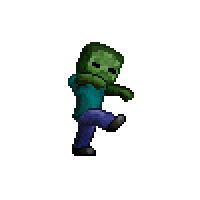

This small mini game involves zombies tracking a player, in which you can collect boxes to collect barbwire. Then using the barbwire slow the zombies slow down. The game ends when a zombie attacks a player.
 
Source:https://github.com/htobin/ManiniProjects2/tree/master/zombieGameFile
