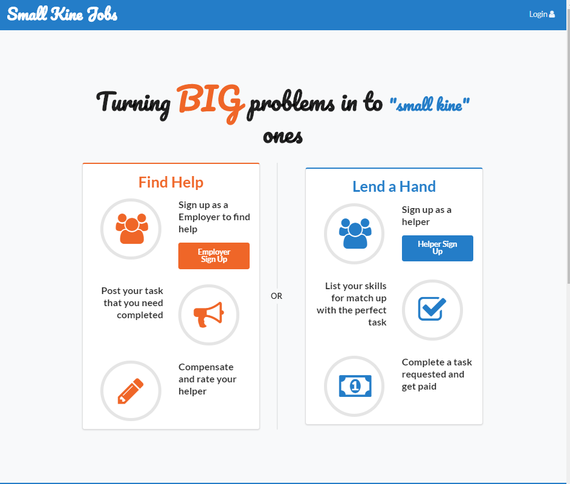

 &emsp;
  This is the app that me and my colleagues in ICS 314 developed for our final project. This project was a test of our knowledge of javascript within the framework of Meteor using React. The app was also developed using the IDE IntelliJ, which also implemented eslint in order to make sure the syntax of the code was properly typed. Eslint was also a valuble tool for formatting certain functions, as well as components of the app as well.
 

 

 &emsp;
  My contribution to this project was the landing page and the sign up page. Our philosophy behind the landing page was that as soon as a new user logs on to the site that they sign up and begin to use it.
 

  

  

&emsp;
The original page had a search bar, and a mini user guide for the app as well. Unfortunately the video was deemed too distracting, and took away from the essence of the page, and what the app is about. So after some thinking, one of my colleagues came up with a nice format for the landing page, while still keeping the philosophy of "land n go".
 
 
 

  

&emsp;
The new landing page was easy to read, and more importantly easy to use. And creating for the functions for the buttons also allowed someone with no javascript experience(i.e. myself) , to create a onClick function. The onClick functions simply went to the appropriate sign up pages, now although this is small thing it also lead to the discovery of how the "Navlink" functions don't work on buttons in Meteor when using React. I know it's small, but I thought it was really cool considering they essentially had the same function but there was a proper implementation of it

&emsp;
The next two pages I worked on were the sign up pages for our "Employers" and "Helpers" who would be using the site. The more complicated of the two was definitely the Helper sign up page. This is because in order to assist our Helpers in finding a job to apply for they can list skills which are keywords that certain jobs will have, which will allow Helpers have a recommended jobs list. The interesting component to the Helper sign up page is as the user enters skills, keywords will populate which the user can choose to allow the jobs to have "skill ids" to pull from, which will both be used by Helpers and Employers.

 
 

  

 
The Employee sign up page was fairly straight forward though

 

  

&emsp;
The final component I worked on was the testimonials part of the landing page. While on the landing page, users can log in to leave a review for Small Kine Jobs, which has a star rating as well. We were also able to make these ratings populate as users left them. Users will leave their name, the rating of Small Kine Jobs, and also a comment as well. 

 

  

<a href="http://smallkinejobs.github.io">Check out the Small Kine Jobs Github page for more info!</a>

