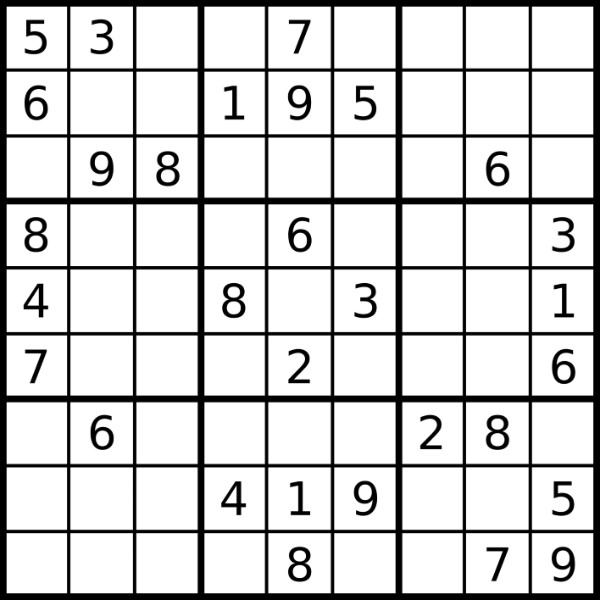

  

This is a sample of some of the cirriculum we had last semester. We had to create a sudoku puzzle solver recursively. It was pretty simple since the creation of the puzzle was already done. As well as the checks in the program were done, all that was needed was to correctly solve it. It was also assumed that all puzzles were solvable.

Early Projects url: https://github.com/htobin/ManiniProjects2

